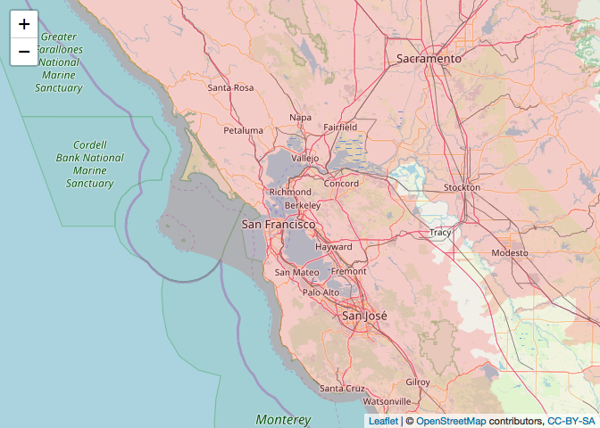

Extinction Filter Database - SF Bay Area, CA
================
Amy Van Scoyoc
4/7/2019

``` r
library(tidyverse)
```

### Step 1:

-   Import table of mammals in the bay area (only including native species). (Source: *<http://www.sfbaywildlife.info/species/mammals.htm>*)
-   Add life history traits to bay area mammals dataframe. (Source: *<http://esapubs.org/archive/ecol/E090/184/>* Date extracted: 4/7/2019)

``` r
# import .csv
sf_mammals <- read.csv("data/sf_mammals.csv", stringsAsFactors = FALSE) %>% 
  mutate(ID = gsub(" ", "", str_trim(scientific_name)))
```

    ## Warning: package 'bindrcpp' was built under R version 3.4.4

``` r
head(sf_mammals)
```

    ##        scientific_name          common_name                  ID
    ## 1 Didelphis virginiana    Virginia Opossum  Didelphisvirginiana
    ## 2        Sorex ornatus        Ornate Shrew         Sorexornatus
    ## 3        Sorex vagrans       Vagrant Shrew         Sorexvagrans
    ## 4        Sorex sonomae           Fog Shrew         Sorexsonomae
    ## 5    Sorex trowbridgii  Trowbridge's Shrew     Sorextrowbridgii
    ## 6 Neurotrichus gibbsii American Shrew mole  Neurotrichusgibbsii

``` r
# import life history traits from PanTHERIA
pantheria <- read.table("http://esapubs.org/archive/ecol/E090/184/PanTHERIA_1-0_WR05_Aug2008.txt", sep = "\t", stringsAsFactors = FALSE, header = TRUE, na.strings = c("NA", "-999", "-999.00")) %>% 
  mutate(ID = gsub(" ", "", str_trim(MSW05_Binomial)))
names(pantheria)[7] <- "bodysize"

# join life history traits to Bay Area mammal dataframe
sf_traits <- left_join(sf_mammals, pantheria, by="ID") %>%  
  arrange(desc(bodysize)) # (porcupine, sperm whale and bottlenose dolphin didn't merge)

# filter dataframe to be mammals with body size >3kg
sf_lg_mammals <- sf_traits %>%
  filter(bodysize > 2000)
length(sf_lg_mammals)
```

    ## [1] 58

### Step 2:

-   Add distribution and abundance maps for each species. (Source: *<https://www.usgs.gov/core-science-systems/science-analytics-and-synthesis/gap/science/species-data-web-services?qt-science_center_objects=0#qt-science_center_objects>*)

``` r
library(leaflet)
library(rgdal)
```

``` r
# read in range data from species folders
range_ex <- readOGR(dsn="data/range_ex",layer="bCALTx_CONUS_Range_2001v1") %>% 
  spTransform(CRS("+proj=longlat +datum=WGS84 +no_defs"))
```

    ## OGR data source with driver: ESRI Shapefile 
    ## Source: "/Users/Amy/Documents/Berkeley Classes/Brashares Lab/projects/extinction-filters/data/range_ex", layer: "bCALTx_CONUS_Range_2001v1"
    ## with 1 features
    ## It has 2 fields

``` r
leaflet() %>% 
  setView(lng = -122.2913, lat = 37.8272, zoom = 8) %>%
  addTiles() %>% 
  addPolygons(data = range_ex, 
              weight = 0,
              fillColor="red",
              fillOpacity = 0.15,
              label = "California Towhee (Pipilo crissalis)")
```


